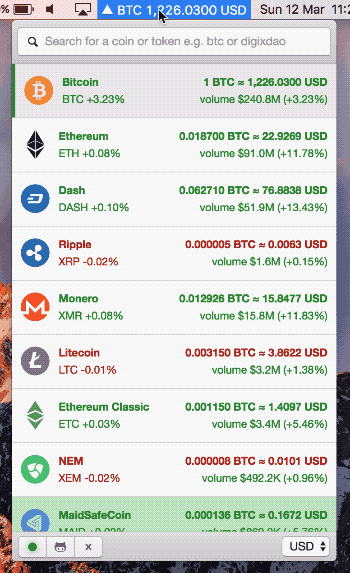

<h1 align="center">
  
   
  Donut
</h1>

<h4 align="center">Cross platform cryptocurrency tracker.</h4>

  
  
  
  
  
  
  
  

<h3>Preview</h3>

<h3>Download</h3>

Builds are available for **macOS**, **Debian/Ubuntu**, **FreeBSD** and **Windows**. Visit [Donut GitHub Releases](https://github.com/harshjv/donut/releases)

<h3>License</h3>

MIT

<small>*Donut icon is designed by [Freepik](http://www.flaticon.com/authors/freepik)*</small>

